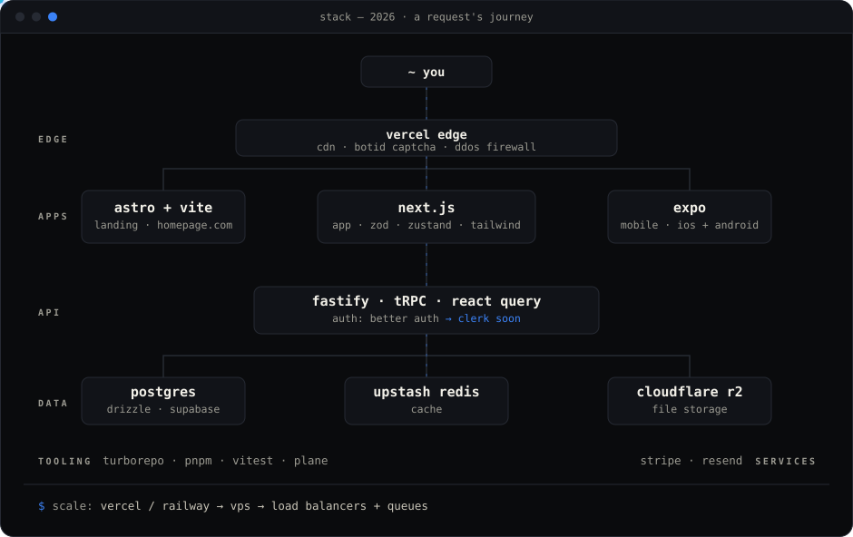

<div align="center">

<a href="https://angelmr.dev"></a>

</div>

<table>
<tr>
<td width="230" valign="middle">
<p><a href="https://angelmr.dev/about"><code>about</code></a></p>
<p><a href="https://angelmr.dev/workspace"><code>workspace</code></a></p>
<p><a href="https://angelmr.dev"><code>projects</code></a></p>
<p><a href="https://angelmr.dev"><code>blog</code></a></p>
<hr/>
<p><a href="https://www.linkedin.com/in/angel-moreno-romera/"><code>linkedin ↗</code></a></p>
<p><a href="https://x.com/_angelmr_"><code>x ↗</code></a></p>
</td>
<td align="right" valign="middle">

</td>
</tr>
</table>

<!--

```console
$ whoami
angelmr — software engineer

$ cat about.txt
Developer passionate about software and hardware.
7+ years as a Software Engineer — most of them before AI became part of
everyday development. That forged solid fundamentals, architecture,
and the practical craft of building and maintaining software efficiently.

I always carry a notebook full of ideas, and the list keeps growing.
Now, in the AI era, for the first time, those ideas might come to life
faster than they pile up.
```

<div align="center">



</div>

```console
$ ls ~/workspace
editor/      → neovim · dotfiles kept reproducible
terminal/    → ghostty · zellij · cmux
agents/      → parallel AI coding agents · 24/7 on a vps
homelab/     → intel nuc + proxmox nodes · docker · unraid · immich
```

<div align="center">

`software, systems, and deliberate craft.` — [`angelmr.dev`](https://angelmr.dev)

</div>

-->
