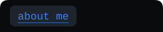
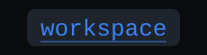
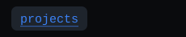
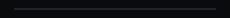
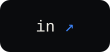

<div align="center">

<a href="https://angelmr.dev"></a>

</div>

<a href="https://angelmr.dev"></a>

<p align="center"><a href="https://angelmr.dev/about"></a><br/><a href="https://angelmr.dev/workspace"></a><br/><a href="https://angelmr.dev"></a><br/><a href="https://angelmr.dev"></a><br/><br/><a href="https://www.linkedin.com/in/angel-moreno-romera/"></a><br/><a href="https://x.com/_angelmr_"></a></p>

<br clear="both"/>

---

# TEST-A heading gigante

## Achievements

<font size="7" color="#ff0000">TEST-B font tag tamaño 7 rojo</font>

TEST-C overflow: `xxxxxxxxxxxxxxxxxxxxxxxxxxxxxxxxxxxxxxxxxxxxxxxxxxxxxxxxxxxxxxxxxxxxxxxxxxxxxxxxxxxxxxxxxxxxxxxxxxxxxxxxxxxxxxxxxxxxxxxxxxxxxxxxxxxxxxxxxxxxxxxxxxxxxxxxxxxxxxxxxxxxxxxxxxxxxxxxxxxxxxxxxxxxxxxxxxxxxxxxxxxxxxxxxxxxxxxxxxxxxxxxxxxxxxxxxxxxxxxxxxxxxxxxxxxxxxxxxxxxxx`

<!--

```console
$ whoami
angelmr — software engineer

$ cat about.txt
Developer passionate about software and hardware.
7+ years as a Software Engineer — most of them before AI became part of
everyday development. That forged solid fundamentals, architecture,
and the practical craft of building and maintaining software efficiently.

I always carry a notebook full of ideas, and the list keeps growing.
Now, in the AI era, for the first time, those ideas might come to life
faster than they pile up.
```

<div align="center">


</div>

```console
$ ls ~/workspace
editor/      → neovim · dotfiles kept reproducible
terminal/    → ghostty · zellij · cmux
agents/      → parallel AI coding agents · 24/7 on a vps
homelab/     → intel nuc + proxmox nodes · docker · unraid · immich
```

<div align="center">

`software, systems, and deliberate craft.` — [`angelmr.dev`](https://angelmr.dev)

</div>

-->
